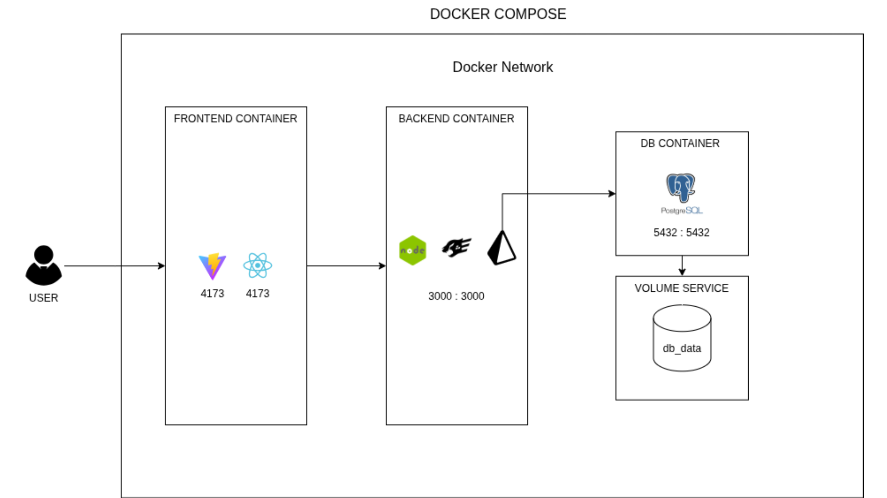

# EventHub

Aplicação web para gerenciamento de eventos, desenvolvida com arquitetura de microsserviços utilizando Docker.

## Arquitetura



A aplicação é composta por três containers Docker que se comunicam através de uma rede interna:
- **Frontend Container**: Interface do usuário (Vite + React) na porta 4173
- **Backend Container**: API REST (Node.js + Fastify) na porta 3000
- **DB Container**: Banco de dados PostgreSQL na porta 5432 com volume persistente

## Tecnologias

### Backend
- Node.js 20+
- Fastify
- Prisma ORM
- PostgreSQL 15
- TypeScript

### Frontend
- React 19
- Vite
- Material-UI
- TailwindCSS
- React Router
- TypeScript

### Infraestrutura
- Docker & Docker Compose
- PostgreSQL 15

## Pré-requisitos

- [Docker](https://docs.docker.com/get-docker/) e [Docker Compose](https://docs.docker.com/compose/install/) instalados

## Como Executar

1. Clone o repositório:
   ```bash
   git clone <URL_DO_REPOSITORIO>
   cd EventHub
   ```

2. Configure as variáveis de ambiente:
   ```bash
   cp .env.example .env
   ```

3. Inicie a aplicação:
   ```bash
   docker compose up --build
   ```

4. Acesse a aplicação:
   - **Frontend**: http://localhost:4173
   - **Backend**: http://localhost:3000
   - **API Docs**: http://localhost:3000/docs

## Estrutura

```
EventHub/
├── backend/          # API REST com Fastify + Prisma
├── frontend/         # Interface React + Vite
├── docker-compose.yml
└── .env
```

## Licença

MIT License
