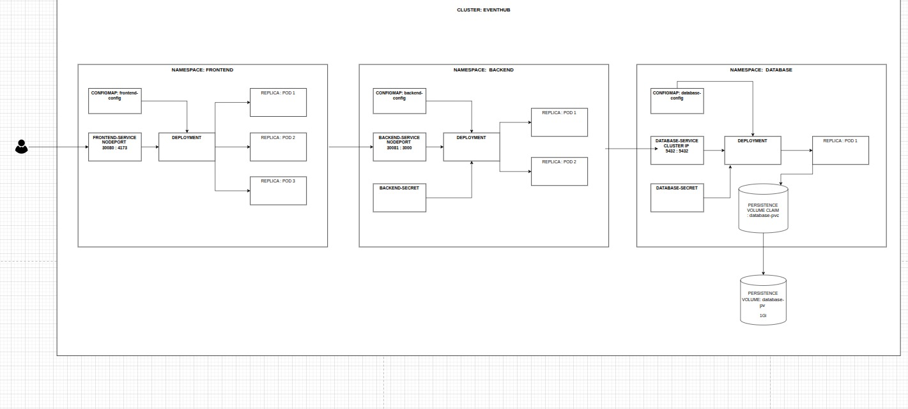

# EventHub

Aplicação web para **gerenciamento de eventos**, desenvolvida com **arquitetura de microsserviços** implantada em um **cluster Kubernetes**.

---

## 🧭 Arquitetura

O sistema é composto por três namespaces independentes — **frontend**, **backend** e **database** — que se comunicam internamente dentro do cluster.



Cada namespace possui seu próprio **Deployment**, **Service**, **ConfigMap** e **Secret**, promovendo isolamento, escalabilidade e segurança.

---

### 🖥️ Namespace: `frontend`

Responsável pela **interface de usuário** construída com **React + Vite**.

- **Deployment:** executa 3 réplicas (Pods) da aplicação React.  
- **Service (NodePort):** expõe a aplicação na porta externa `30009`, mapeando para a porta interna `4173`.  
- **ConfigMap (`frontend-config`):** contém variáveis de ambiente e configurações do frontend.

📍 **Acesso externo:**  
`http://<NODE_IP>:30009`

---

### ⚙️ Namespace: `backend`

Responsável pela **API REST** desenvolvida com **Node.js + Fastify**, atuando como intermediário entre o frontend e o banco de dados.

- **Deployment:** executa 2 réplicas (Pods) da API.  
- **Service (NodePort):** expõe a API na porta externa `30081`, mapeando para a porta interna `3000`.  
- **ConfigMap (`backend-config`):** define variáveis de ambiente.  
- **Secret (`backend-secret`):** armazena credenciais sensíveis (ex: conexão com o banco de dados).

📍 **Acesso interno:**  
`http://backend-service.backend.svc.cluster.local:3000`

---

### 🗄️ Namespace: `database`

Responsável pelo banco de dados **PostgreSQL 15**, com armazenamento persistente.

- **Deployment:** executa 1 Pod do PostgreSQL.  
- **Service (ClusterIP):** permite comunicação interna com o backend na porta `5432`.  
- **ConfigMap (`database-config`):** define parâmetros de inicialização.  
- **Secret (`database-secret`):** armazena usuário e senha do banco.  
- **PersistentVolumeClaim (`database-pvc`):** solicita armazenamento persistente.  
- **PersistentVolume (`database-pv`):** volume de **1 GiB** que garante persistência dos dados.

📍 **Acesso interno:**  
`postgres://<user>:<password>@database-service.database.svc.cluster.local:5432/eventhub`

---

## 🧩 Tecnologias Utilizadas

### Backend
- Node.js 20+
- Fastify
- Prisma ORM
- PostgreSQL 15
- TypeScript

### Frontend
- React 19
- Vite
- Material-UI
- TailwindCSS
- React Router
- TypeScript

### Infraestrutura
- Kubernetes
- ConfigMaps & Secrets
- Deployments & Services
- Persistent Volumes (PV/PVC)

---

## ⚙️ Pré-requisitos

- Cluster **Kubernetes** configurado (local ou cloud)
- **kubectl** e **helm** instalados e configurados
- Imagens do **frontend**, **backend** e **database** publicadas em um registro (ex: Docker Hub)

---

## 🚀 Como Implantar

1. Clone o repositório:
   ```bash
   git clone <URL_DO_REPOSITORIO>
   cd EventHub

2. Crie os namespaces
   ```bash
   kubectl apply -f k8s/namespaces.yaml

3. Aplique os manifests:
   ```bash
   kubectl apply -f k8s/database/
   kubectl apply -f k8s/backend/
   kubectl apply -f k8s/frontend/

4. Verifique os recursos implantados:
   ```bash
   kubectl get pods -A
   kubectl get svc -A

5. Acesse a aplicação:
- Frontend: http://<NODE_IP>:30009
- Backend: http://<NODE_IP>:30081
- Banco: acesso interno via ClusterIP